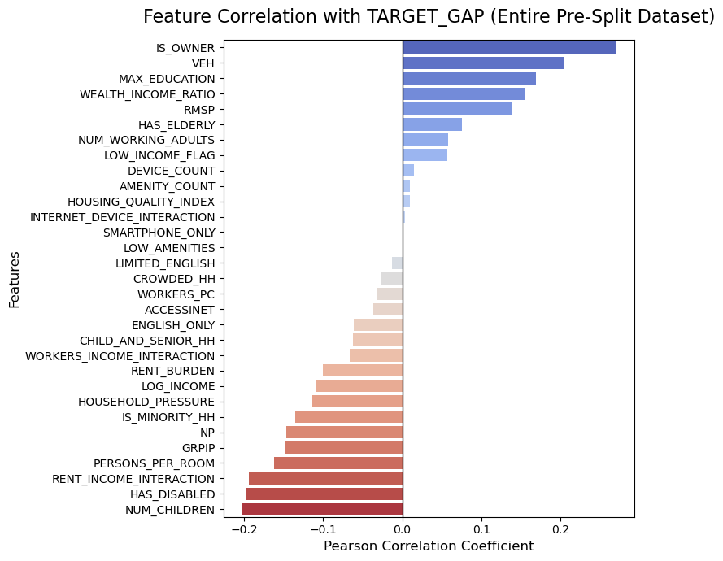

# Erdős Project: Predicting the SNAP Gap via Socioeconomic Proxies

## 1. Project Objective and Motivation
The Supplemental Nutrition Assistance Program (SNAP) is a vital federally-funded initiative designed to reduce food insecurity and hunger. By providing monthly EBT credits for groceries, SNAP improves health outcomes, stabilizes vulnerable households during financial hardship, and strengthens local economies. 

Despite the program's immense benefits, there is a persistent "invisible barrier" preventing full enrollment. Our exploratory data analysis revealed a staggering statistic: **approximately 66% of low-income households in our dataset are eligible for SNAP but are not receiving it**. This participation gap indicates that structural barriers—such as lack of awareness, language barriers, and application complexity—are leaving highly vulnerable populations without assistance. 

**The Goal:**
The core objective of this project is to answer a key question: *Can we identify eligible but non-participating households using observable data?* We aim to build a predictive classification model that identifies these vulnerable households (the "SNAP Gap") purely through socioeconomic, demographic, and technological proxy features. By making this gap predictable, policymakers and community organizers can leverage our model to prioritize application assistance and conduct highly targeted outreach.

---

## 2. Team Members
This project was developed during the **Erdos Data Science Bootcamp 2026** by the following team:

* **Aditi Sen** * [LinkedIn](https://www.linkedin.com/in/aditisen31394) | asen73559@gmail.com
* **Zhenyu Yue**
  * [LinkedIn](https://www.linkedin.com/in/zhenyu-yue-595bab168) | yuezhenyuhm@gmail.com 
* **Samia Albalawi**
  * [LinkedIn](#) | Samia6mb@gmail.com 

*(Special thanks to our project mentor Noimot Bakare, the Erdos Institute, Roman Holowinsky, Steven Gubkin, and Alec Clott for their guidance.)*

---

## 3. Data Strategy, Processing & Feature Engineering

### 3.1. Data Sourcing and Merging
Our foundational data comes from the **2023 American Community Survey (ACS) 1-Year Public Use Microdata Sample (PUMS)**. We specifically focused our analysis on the states of Maryland (MD), Virginia (VA), and Washington D.C. 

Because the Census provides information at multiple grains, we joined the massive Household (`h`) and Person (`p`) datasets using `SERIALNO` as our primary merging key. This allowed us to aggregate individual-level demographics into household-level summaries.

### 3.2. Defining the Target Population and Variable
To build a highly focused model, we subset our entire standard population down to **only low-income households** (defined as households at or below 130% of the poverty line). Within this filtered population, we established our binary target variable representing the "SNAP Gap":
* **Class 1 (The Gap):** Low-income households that do *not* receive SNAP benefits.
* **Class 0 (Non-Gap / Participating):** Low-income households that *are* successfully receiving SNAP benefits.

*By restricting our dataset to only those who are income-eligible, we force the model to learn the structural and demographic barriers to participation rather than simply learning the characteristics of poverty.*

### 3.3. Data Cleaning Procedures
To ensure our machine learning models trained only on the highest quality signals, we applied aggressive filtering:
* **Ground-Truth Preservation:** We dropped any rows where SNAP benefit values were imputed by the Census (`FFSP == 1`) to guarantee our labels reflected reality. 
* **Removing Institutional Living:** We excluded Group Quarters from our analysis, keeping only standard standard households.
* **Dimensionality Reduction:** The raw PUMS data includes hundreds of columns utilized by the Census for complex variance estimation (e.g., replicate weights) and statistical allocation flags. We stripped these out entirely as they add noise to standard machine learning models. Furthermore, explicit income and SNAP status columns were strictly removed from the feature matrix to prevent data leakage during training.

### 3.4. Advanced Feature Engineering
Because true income and current SNAP status are explicitly excluded from the model predictions, we engineered several powerful socioeconomic proxy features to capture the nuances of household stability and access barriers:

* **Economic Stability & Capacity:** * *Income Proxies:* We created logarithmic transformations of household income (`LOG_INCOME`) to handle skewness, established relative low-income flags based on median splits, and calculated a `WEALTH_INCOME_RATIO`.
  * *Labor/Earning Capacity:* We engineered a `WORKERS_PC` (workers per capita) metric, and a `DEPENDENCY_RATIO` (the ratio of non-working individuals to total household size).
* **Housing Pressure & Stability:**
  * We built a `RENT_BURDEN` indicator flagging households where gross rent consumes more than 50% of their income.
  * We included metrics indicating crowding (rooms per person), basic amenities, and an `IS_OWNER` flag for homeownership status.
* **Access & Isolation Proxies:** * *Language Isolation:* We extracted a Limited English Proficiency flag (`LNGI`), which proved to be an extremely vital signal for program non-participation.
  * *Technological Access:* We captured data regarding broadband internet access, smartphone ownership, and laptop availability.
* **Complex Interactions:** We computed cross-feature interactions, such as `RENT_INCOME_INTERACTION` and `WORKERS_INCOME_INTERACTION`, to allow models to find multidimensional thresholds of poverty and stability.

## 4. Exploratory Data Analysis (EDA) Insights

To understand the systemic barriers to SNAP participation, we isolated our dataset strictly to households mathematically eligible for assistance (at or below 130% of the poverty line). 

### The Data Funnel
By tracking the population through our strict filtering process, the sheer scale of the participation gap became immediately apparent:
* **Initial Raw Data:** ~74,000 households (over 157,000 individuals across MD, VA, and DC)
* **Standard Households:** Removed Group Quarters and imputed/allocated census records to preserve ground-truth accuracy.
* **Eligible Low-Income Subset:** Narrowed the scope down to **7,450** strict low-income households.
* **The SNAP Gap:** Within this vulnerable group, **66.2% (approx. 4,929 households)** are in the Gap (not receiving SNAP), while only **33.8% (approx. 2,521 households)** are successfully enrolled. 

### Key Feature Insights
We analyzed the distributional differences between the enrolled households and the Gap households. Two major themes emerged:

1. **The "Asset" Association:** Counterintuitively, households in the SNAP Gap often possess protective financial or physical assets (such as homeownership or higher maximum education levels) compared to standard SNAP recipients. These households may be experiencing temporary income shocks. Despite being mathematically eligible, they may falsely assume they do not qualify or possess a stigma against applying for government assistance.
2. **The Language Factor:** Speaking a language other than English is one of the strongest statistical predictors of falling into the Gap. Households with Limited English Proficiency (`LNGI`) face a massive drop-off in participation, highlighting a clear structural barrier: application complexity and lack of multilingual outreach directly prevent eligible families from accessing food assistance.

*(Below is the feature correlation graph highlighting the strongest predictors of a household falling into the SNAP Gap)*

## 5. Modeling & Evaluation

To accurately identify households falling into the SNAP Gap, we rigorously trained and evaluated multiple machine learning algorithms. 

### Data Splitting & Preparation
To prevent data leakage and ensure a robust, generalizable evaluation, we split our strictly low-income dataset into three subsets:
* **Training Set:** 70% (5,215 households) 
* **Validation Set:** 15% (1,117 households) - Used strictly for hyperparameter tuning and model selection.
* **Test Set:** 15% (1,118 households) - A completely unseen holdout set for the final, unbiased evaluation.

**Handling Class Imbalance (SMOTE):**
Because our filtered eligible population is heavily skewed toward those *not* receiving SNAP (~66% Gap vs ~34% Enrolled), we applied **SMOTE (Synthetic Minority Over-sampling Technique)** exclusively to the training set. This synthesized new examples of the minority class (enrolled households), perfectly balancing the training data without leaking synthetic data into the validation or test sets.

### Model Selection (Validation Set)
We tested a baseline Logistic Regression model against advanced tree-based ensembles. Models were optimized and evaluated using the **ROC-AUC metric** alongside precision, recall, and F1-scores specifically for identifying **"The Gap" (Class 1)**. 

Balancing false positives (wasted outreach) and false negatives (missing a vulnerable household) was critical. While XGBoost achieved the highest strict precision, **LightGBM** was selected as our champion model for achieving the highest overall ROC-AUC and the best balance of recall and precision.

| Model | Validation ROC-AUC | Gap Precision | Gap Recall | Gap F1-Score |
| :--- | :--- | :--- | :--- | :--- |
| **LightGBM** | **0.8188** | 0.82 | **0.83** | **0.83** |
| XGBoost | 0.8164 | **0.86** | 0.74 | 0.79 |
| Random Forest | 0.8148 | 0.81 | 0.80 | 0.81 |
| Logistic Regression | 0.7702 | 0.82 | 0.73 | 0.77 |

### Final Champion Model & Test Performance
To maximize LightGBM's ability to handle complex socio-economic proxy interactions without overfitting, we tuned its hyperparameters via grid search:
* **Key Hyperparameters:** `n_estimators: 200`, `learning_rate: 0.05`, `max_depth: 7`, `num_leaves: 31`, `subsample: 0.8`, `colsample_bytree: 0.7`

**Final Unbiased Test Set Results:**
When evaluating the tuned LightGBM model on our fully unseen 15% test holdout, it demonstrated highly consistent generalization:
* **Final Test ROC-AUC:** **0.7988**
* **Final Gap Metrics:** 82% Precision, 81% Recall, 81% F1-Score (Overall Accuracy: 75%).

By maintaining over 80% on both Precision and Recall on completely unseen data, the model proves highly effective at accurately flagging the most vulnerable non-participating households while keeping false alarms to a minimum.

## 6. Key Takeaways & Actionable Recommendations
Based on our feature correlations and predictive modeling, we recommend the following for policymakers and stakeholders:

* **The "Asset" Association:** The data shows a strong correlation between gap households and protective financial factors (like homeownership and higher education).
* **The Language Factor:** Speaking languages other than English is one of the strongest statistical predictors of falling into the gap, highlighting a clear intersection between language differences and program non-participation.
* **Action Steps:** Prioritize expanding multilingual application support, bilingual caseworkers, and localized community partnerships to engage the most at-risk sub-populations.